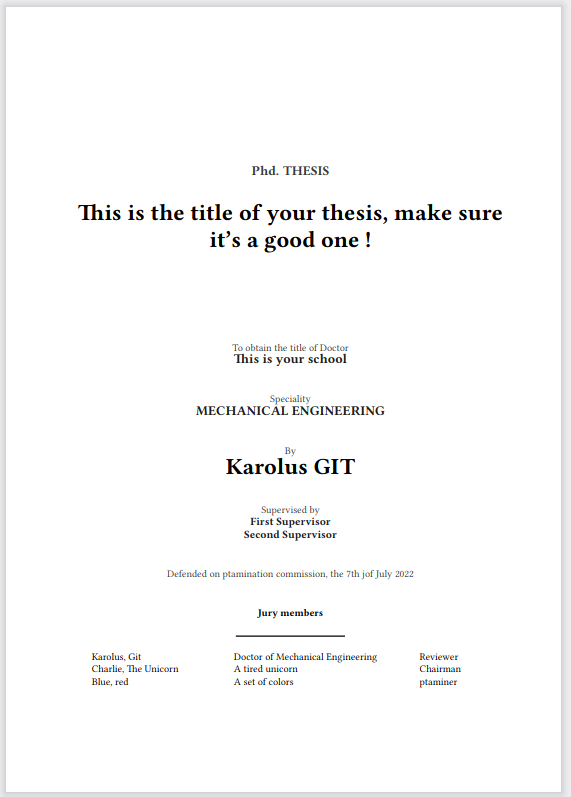
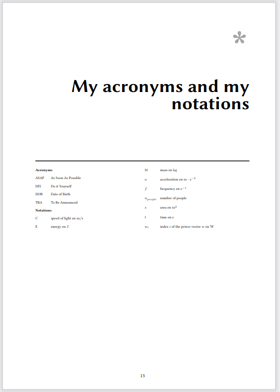
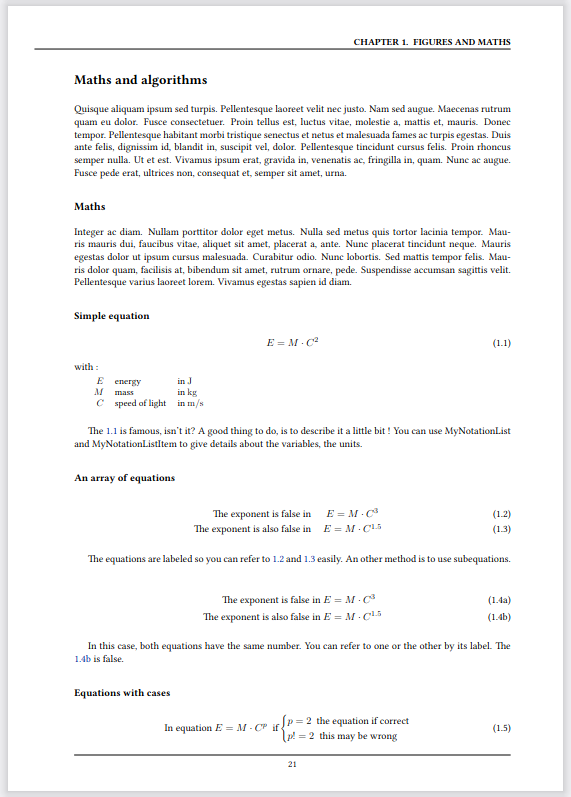
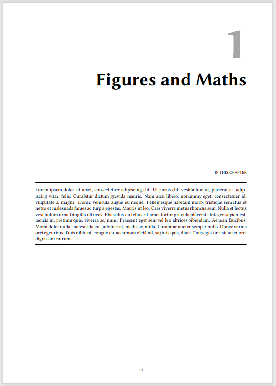

# Thesis-latex-template

## Description

I'm happy to share with you the template I used during my thesis! At that time, I didn't kown anything about Docker... But now, everything is easy :)

### Screenshots 

### Table of contents 

* Abstract
* Acknowledgements
* Tables
    * List of figures
    * List of tables
* Notations
* Introduction
* Chapter one
    * Section one
* Conclusion
* Bibliography
* Appendix

## Docker commands

All the options are managed by the manage.sh file in the docker folder.

To compile the image :
`bash manage.sh build`

Once you have the image, you can run the container as a daemon :
`bash manage.sh start`

Launch the compilation of your thesis:
`bash manage.sh compile`

To stop the daemon:
`bash manage.sh stop`

.. note::
    You can try to make the `manage.py` executable by changing the permissions with the  `chmod +x manage.sh` command.

## Credit

blang/latex-docker

